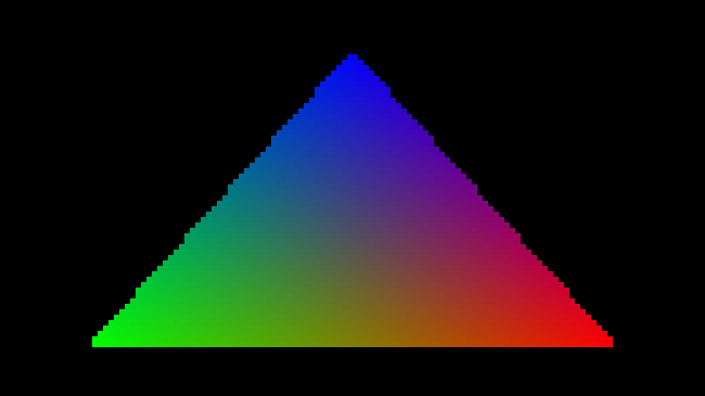

# Native presentation of QEMU guest shader frames

Later [typed texture tests](LIVE-GPU-NATIVE-METADATA.md) reproduced zero DXGI
frame statistics in two fresh presentation attempts despite successful imports
and correct first-frame backbuffer pixels. Those runs are rejected. The accepted
runs below are historical evidence and do not establish display stability.

Two fresh owned QEMU/WHPX runs on 2026-10-10 copied two distinct guest-rendered
NVIDIA frames into a native Windows DXGI swapchain. Every backbuffer RGBA byte
matched the corresponding guest frame. `Present(1, 0)`, the presentation queue
fence and DXGI frame statistics completed for counts 1 and 2 in both runs.

This extends the [retained Windows GPU consumer](LIVE-GPU-SHARED-TEXTURE-CONSUMPTION.md)
with a bounded diagnostic window. Accelerated Omarchy/Hyprland, general Linux
display integration and the requested performance remain unfinished. An
intermittent native import failure was reproduced in a separate control and
remains unresolved; the checkpoint does not establish stability.

[Hardware evidence](evidence/QEMU-LIVE-GPU-PRESENTATION-2026-10-10.json)
contains both accepted runs, the failed import control and its fresh passing
repeat, the wrong-workload rejection, complete ownership/retirement receipts,
source/executable hashes and hashes of the original private reports and logs.

## GPU path and presentation evidence

The guest still draws and independently verifies two 130×73 RGBA8 frames,
transitions its shared texture to `COMMON` and signals an owned workload fence.
Windows validates ownership and native retirement before consuming it. No
rendered pixels travel in the handoff request.

The native consumer retains its imported texture, DEFAULT texture, device,
DIRECT queue, allocator/list and fences. With the additional
`--driver-present-shared` opt-in it also retains a fixed Windows window, one
two-buffer `FLIP_SEQUENTIAL` RGBA8 swapchain and its backbuffers. The window
client area is 780×438 and DXGI stretches the 130×73 buffers for visibility.
The same native queue/device serves both copying and presentation.

Windows copies the imported resource to its DEFAULT texture and then copies
that texture directly into the current swapchain backbuffer. Explicit barriers
return the guest source and native texture to `COMMON`, and the backbuffer to
`PRESENT`. A diagnostic GPU copy exports every backbuffer byte through a separate
readback buffer before presentation. There is no CPU image upload.

The verifier requires all 37,960 actual backbuffer bytes per round to equal the
guest bytes, in addition to matching the native DEFAULT texture readback.
Windows then calls `Present(1, 0)`, signals and retires a separate presentation
queue fence, checks `GetLastPresentCount`, calls `DwmFlush`, and waits for
`GetFrameStatistics` to report that frame with a positive, increasing QPC time.
The two backbuffer indices must rotate. Visible window state, normal resource
release and window/class destruction are also required. A queued present,
occlusion, stale statistics, wrong pixels or pending GPU work cannot pass.

| Frame | Guest / native texture / backbuffer FNV-1a | Present count | Backbuffer |
| --- | --- | --- | --- |
| Blue background | `7ee55ce8ce7f7ee1` | 1 | 0 |
| Black background, rotated colors | `fb1b3577b0f6bcbf` | 2 | 1 |

The image is an export of actual GPU pixels, enlarged 6× with nearest-neighbor sampling.
Its dense RGBA SHA-256 is
`fd894f123883a31e65cea02dc84eb9a52f0356511b4a85eb41977d8c46814353`.
The new independently exported native backbuffer reproduces the existing
published PNG exactly. It is not a screenshot of a Windows window. Native window
capture and its recovery attempt both returned
`foreground window did not report a process id`; no window screenshot is claimed.
DXGI statistics can be unreliable in some multiple-monitor/fullscreen scenarios;
this result is specific to the tested local configuration.

## Controls and cleanup

Each accepted presentation run retired 14 native guest commands, four hardware
queue signals, two native consumption copies and two presentation queue fences.
One retained consumer and presenter served both frames and were released once.
All 124 guest allocations, both resources and 89 synchronization objects were
destroyed. Native/QEMU capacity limits were unchanged.

| Case | Overall accepted | Underlying presentation | Cleanup |
| --- | --- | --- | --- |
| First presentation run | Yes | Both frames verified | Verified |
| Fresh presentation repeat | Yes | Both frames verified | Verified |
| Presentation disabled, first control | No | No swapchain created; import failed | Verified |
| Same control, fresh repeat | Yes | Disabled; both GPU consumption copies verified | Verified |
| Wrong workload (`shared` verifier, actual `consume` guest) | No | Both frames physically verified; public success fields remain false | Verified |

The failed control returned `E_NOINTERFACE` (`0x80004002`) from
`OpenSharedHandle` in both the initial resource import probe and the retained
consumer. Native device creation succeeded. No native consumer copy or
swapchain was created. All ten commands and two queue signals from that partial
guest workload retired, and owned teardown passed. The original rejection is
preserved. The next fresh run with the same configuration passed; this is not a
fix or a stability result. Earlier shared-resource evidence also preserves an
unresolved import failure of this kind.

MSVC `/W4 /WX` and four native ownership/protocol contracts pass. All 77 CLI
rejection cases and 40 milestone guard groups pass. The guest image and seven
guest protocol/build inputs are unchanged from the previous consumer checkpoint;
the private initramfs and its three built diagnostic binaries are hash-checked.

## Reproduction and remaining work

Build the host with `experimental/windows-native-gpu/build.ps1`. Use the private
guest image packed with `--runtime-workload consume`, and select that workload
in `test_owned_runtime_qemu.py`. Add `--driver-present-shared` to the consumer's
existing shared-resource, consumption, asynchronous-submission and sync opt-ins.
Presentation requires consumption, and all existing owned-QEMU gates apply.
The default launcher does not select the experimental backend.

This diagnostic has only two frames, CPU-synchronized handoffs, three readbacks
per frame (guest, native texture and native backbuffer), and a three-second
visible pause per frame for inspection. It is not a throughput or latency
benchmark. Production display still needs GPU fence scheduling, multiple frames
in flight, general guest kernel/DRM integration, window/input/resize handling
and device-loss recovery, with diagnostic readback and pauses removed.
CUDA, OpenGL, Vulkan, video acceleration and at least 93% of native performance
remain unverified. See [product acceptance](PRODUCT-ACCEPTANCE.md).

Microsoft documents [D3D12 swapchain queues, buffers and PRESENT state](https://learn.microsoft.com/en-us/windows/win32/direct3d12/swap-chains),
[Present results including occlusion](https://learn.microsoft.com/en-us/windows/win32/api/dxgi/nf-dxgi-idxgiswapchain-present)
and [frame statistics and their configuration limits](https://learn.microsoft.com/en-us/windows/win32/api/dxgi/nf-dxgi-idxgiswapchain-getframestatistics).
